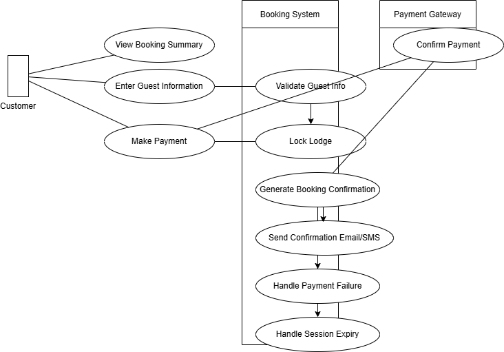

# Requirement Analysis in Software Development

The Requirement Analysis Project focuses on crafting a comprehensive foundation for software development by documenting, analyzing, and structuring requirements.

# What is Requirement Analysis?
Requirement analysis is the process of defining, documenting, and analyzing the needs and expectations of a software system. It involves gathering and understanding the requirements from stakeholders, users, and other relevant parties. The goal is to create a clear and complete understanding of what the software should do, how it should behave, and what features it should include. The importance of requirement analysis cannot be overstated. It is the first step in the software development process and lays the groundwork for the entire project. A well-defined set of requirements ensures that the software developed meets the needs of the users and stakeholders, resulting in a successful and satisfying outcome.

# Why is Requirement Analysis Important?
Requirement analysis is important for several reasons:

1. **Clarity and Understanding**: It helps to ensure that everyone involved in the project has a clear understanding of what is expected. This reduces misunderstandings and miscommunications that can lead to delays and additional costs.

2. **Alignment with Business Goals**: By clearly defining the requirements, the software development team can align their work with the overall business objectives. This ensures that the software being developed is relevant and useful.

3. **Quality Assurance**: A thorough requirement analysis helps to identify potential issues early in the development process. This allows for better quality assurance and testing, ultimately leading to a higher-quality product.

4. **Efficiency**: Well-defined requirements help to avoid rework and scope creep. This leads to a more efficient development process and helps to keep the project on track and within budget.

# Key Activities in Requirement Analysis

1. **Requirement Gathering**: This involves collecting information from stakeholders, users, and other relevant parties. This can be done through interviews, surveys, observations, and other methods.

2. **Requirement Elicitation**: This involves identifying and clarifying the needs and expectations of the stakeholders and users. This may involve creating use cases, user stories, and other artifacts that capture the requirements.

3. **Requirement Documentation**: This involves creating a detailed document that captures all the requirements. This document serves as a reference throughout the development process and helps to ensure that everyone is working from the same set of requirements.

4. **Requirement Analysis and Modeling**: This involves analyzing the gathered requirements to ensure they are complete, consistent, and achievable. This may involve breaking down complex requirements into smaller, more manageable ones.

5. **Requirement Validation**: This involves verifying that the requirements meet the needs of the stakeholders and users. This may involve prototyping, user testing, and other methods.

# Types of Requirements
There are several types of requirements that may be encountered during requirement analysis:

1. **Functional Requirements**: These are the requirements that define what the software should do. They describe the features and functionality of the software.
    - Example:
      - Hotel Management (for owners/managers).
      - Customer Services (for users).
      - View Booking History
      - Notification System
      - Analytics and Reporting

2. **Non-Functional Requirements**: These are the requirements that define how the software should behave. They describe the performance, security, and other qualities of the software.
    - Example:
      - Performance
      - Security
      - Low Latency
      - Maintainability
      - Scalability and Availability

# Use Case Diagrams

Use case diagrams are a type of UML diagram that is used to model the interactions between the actors and the system. They are used to capture the requirements of the system in a visual format. The benefits of use case diagrams include:

1. **Clarity**: Use case diagrams provide a clear and concise representation of the requirements of the system. This helps to ensure that everyone involved in the project has a clear understanding of what is expected.

2. **Communication**: Use case diagrams are a useful tool for communicating the requirements of the system to stakeholders and users. This helps to ensure that everyone is on the same page and that there are no misunderstandings.

3. **Validation**: Use case diagrams can be used to validate the requirements of the system. This helps to ensure that the requirements are complete, consistent, and achievable.

# Acceptance Criteria

Acceptance criteria are a set of conditions that must be met for a requirement to be considered complete. They are used to ensure that the software developed meets the needs of the users and stakeholders. 

The importance of acceptance criteria cannot be overstated. They provide a clear and objective way to measure the success of the software development project. They help to ensure that the software developed meets the needs of the users and stakeholders, resulting in a successful and satisfying outcome. For a Checkout feature in a booking system, the acceptance criteria may include:

1. The user should be able to view their booking details before checkout.
2. The user should be able to select a payment method.
3. The user should be able to enter their payment information.
4. The user should be able to confirm their booking.
5. The user should receive a confirmation email after checkout.
